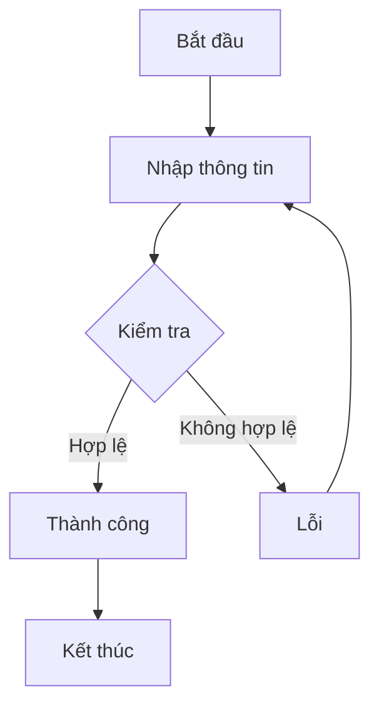

 # Test Mermaid trên GitHub 
## Biểu đồ đầu tiên của tôi 

```mermaid 
graph TD 
    Start[Bắt đầu] 
    Input[Nhập thông tin] 
    Validate{Kiểm tra} 
    Success[Thành công] 
    Error[Lỗi] 
    End[Kết thúc]
    Start --> Input 
    Input --> Validate 
    Validate -->|Hợp lệ| Success 
    Validate -->|Không hợp lệ| Error 
    Success --> End 
    Error --> Input 
```
